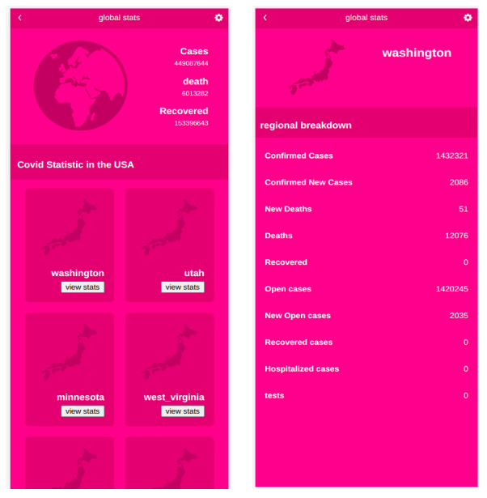

# US Covid API

web app for showing covid 19 statistics in the united states of ammerica by state as regions, 
built using ReactJS and redux. the  data is from [Narrativa](https://covid19tracking.narrativa.com/index_en.html)

## Built With 
 - React
 - Redux
 - Jest
## Getting started
clone the project using the command 

`https://github.com/banlon-jones/covid-app.git` 

## Demo

https://global-covid-data.netlify.app/

### `npm start`

Runs the app in the development mode.\
Open [http://localhost:3000](http://localhost:3000) to view it in your browser.

The page will reload when you make changes.\
You may also see any lint errors in the console.

### `npm test`

Launches the test runner in the interactive watch mode.\
See the section about [running tests](https://facebook.github.io/create-react-app/docs/running-tests) for more information.

### `npm run build`

Builds the app for production to the `build` folder.\
It correctly bundles React in production mode and optimizes the build for the best performance.

The build is minified and the filenames include the hashes.\
Your app is ready to be deployed!

See the section about [deployment](https://facebook.github.io/create-react-app/docs/deployment) for more information.

## Authors

### Author 1
 - Github: [banlon-jones](https://github.com/banlon-jones)
 - LinkedIn: [banlon jones](https://www.linkedin.com/in/banlon-jones-b0205812a)

## Acknowledgments

- inspiration from Microverse 
https://github.com/microverseinc/curriculum-react-redux/blob/main/capstone/react_capstone.md
- [Original design idea by Nelson Sakwa on Behance](https://www.behance.net/sakwadesignstudio)
